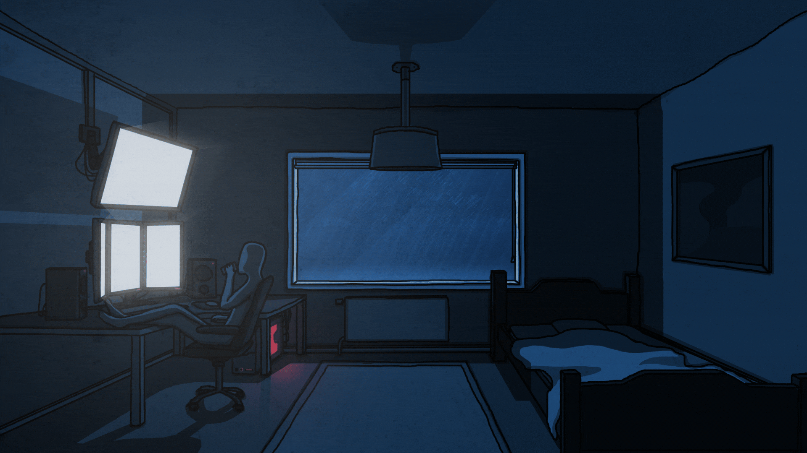

# Hello world, my name is Denis

  

&nbsp;

&nbsp;

&nbsp;
<!-- 
&nbsp; -->

## school 42 projects

&nbsp;

&nbsp;

&nbsp;

&nbsp;

&nbsp;

&nbsp;

&nbsp;

&nbsp;

## frontend projects

&nbsp;

&nbsp;

## devops projects

&nbsp;

